# 이력서

# 소개

- 
- 이름 : 홍승택
- 생년월일: 1997년 10월 4일
- 거주지 : 춘천
- 군필여부: 군필(사회복무요원)
- 취미 : 게임, 게임방송, 농구, 영화감상
- E-mail: tmdxor97@naver.com

# 학력
- 인창고등학교 졸업(2016)
- 한림대학교 빅데이터 전공 재학중(2016~ ing)

# 자격증
| 자격증 | 응시일자 |
|---------|--------|
|한국사(2급)|2018.05.16|
|MOS 엑셀|2017.05.16|
|MOS 액세스|2016.10.26|

## 목표 자격증 ( x= 완료 )
- [   ] 컴퓨터활용능력자격증(1급)
- [   ] 워드프로세서
- [   ] 토익 800점 (현재 720점)

# 경력
## 근무경력
- 사회복무요원 근무중 엑셀 관련 업무(매크로 작성 多)(2017.08.10~2019.07.17)

## 장학금
- 한림추천장학금 (2016년 2학기)

## 프로그래밍 언어 및 학습지식

- C
- C++
- C# (미흡)
- java
- python
- R
- 딥러닝 (기본 지식)
   - 타이타닉 데이터를 통한 딥러닝
   - 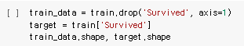
   - 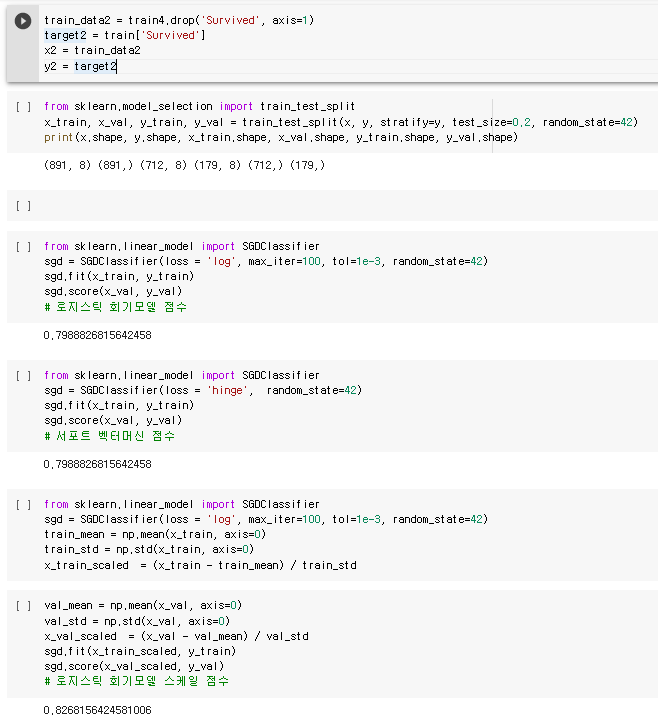
   - 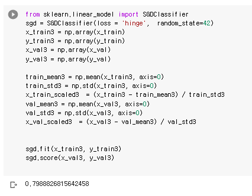
# 프로젝트
## C++를 통한 유사 배달앱 프로그램
---
### 출력 화면
- 시작화면
- 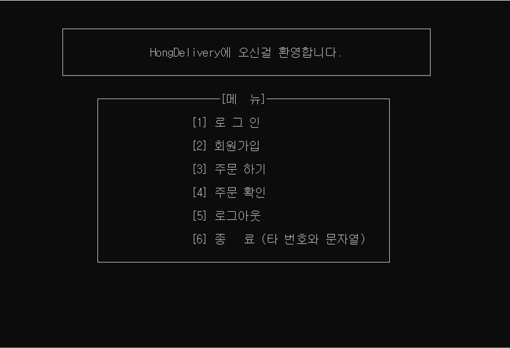
- 회원가입 및 로그인
- 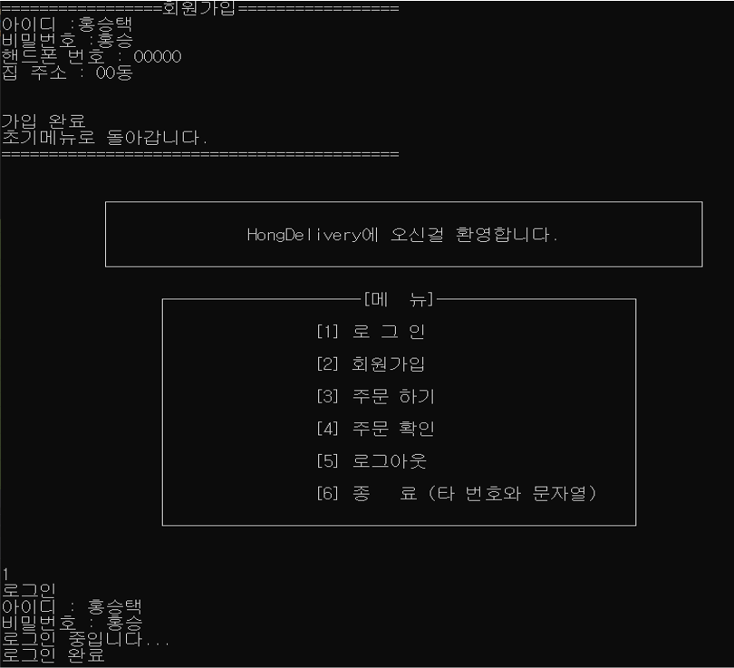
- 주문 시도
- 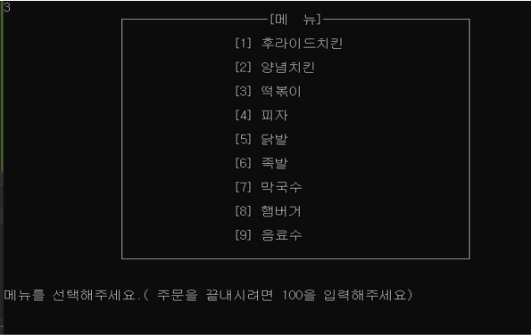
- 주문 후 메뉴에서 주문내역 확인가능
- 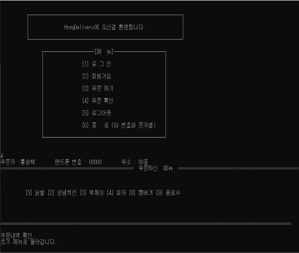
- 로그아웃
- 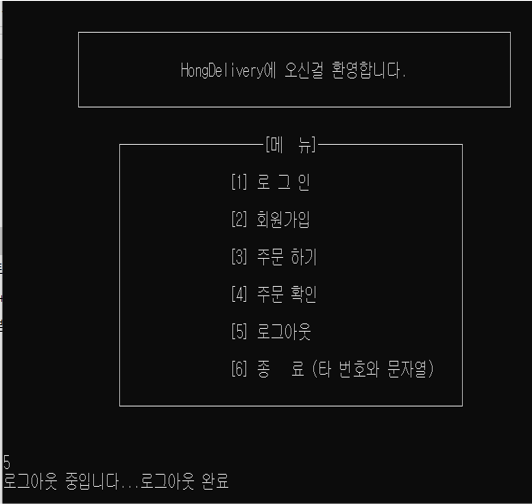
- 관리자계정 로그인 및 로그인 상태시 로그인과 회원가입 시도 불가능
- 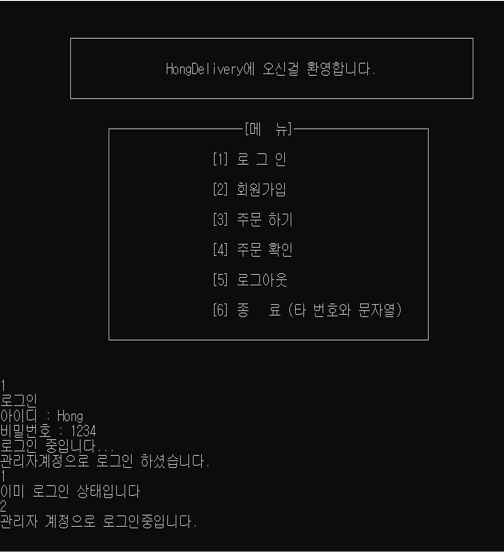
- 관리자 계정으로 고객 주문 확인
- 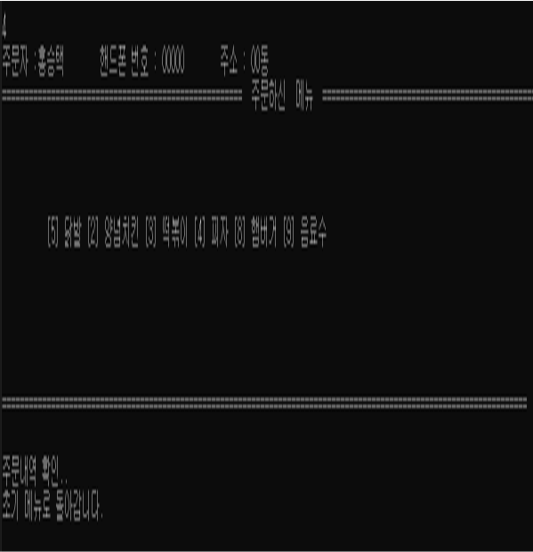
- 프로그램 종료
- 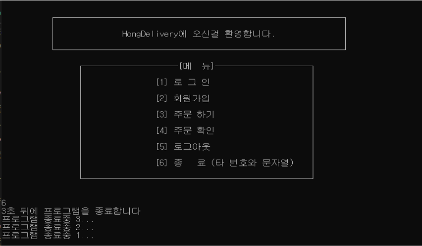

---